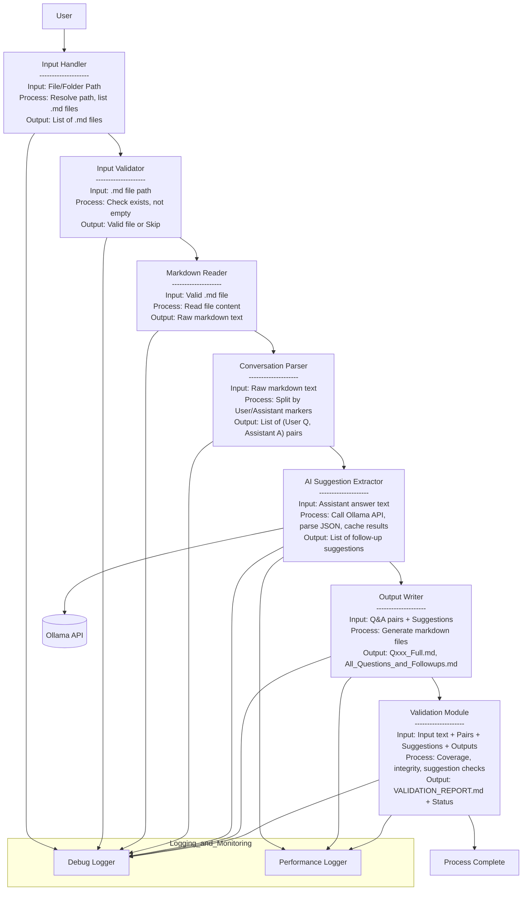

```mermaid
flowchart TB

    U[User] --> IH

    IH["Input Handler
--------------------
Input: File/Folder Path
Process: Resolve path, list .md files
Output: List of .md files"] --> IV

    IV["Input Validator
--------------------
Input: .md file path
Process: Check exists, not empty
Output: Valid file or Skip"] --> MR

    MR["Markdown Reader
--------------------
Input: Valid .md file
Process: Read file content
Output: Raw markdown text"] --> CP

    CP["Conversation Parser
--------------------
Input: Raw markdown text
Process: Split by User/Assistant markers
Output: List of (User Q, Assistant A) pairs"] --> AE

    AE["AI Suggestion Extractor
--------------------
Input: Assistant answer text
Process: Call Ollama API, parse JSON, cache results
Output: List of follow-up suggestions"] --> OW

    OW["Output Writer
--------------------
Input: Q&A pairs + Suggestions
Process: Generate markdown files
Output: Qxxx_Full.md, All_Questions_and_Followups.md"] --> VM

    VM["Validation Module
--------------------
Input: Input text + Pairs + Suggestions + Outputs
Process: Coverage, integrity, suggestion checks
Output: VALIDATION_REPORT.md + Status"] --> END

    END[Process Complete]

    %% External System
    AE --> OA[(Ollama API)]

    %% Side Systems
    subgraph Logging_and_Monitoring
        DL[Debug Logger]
        PL[Performance Logger]
    end

    IH --> DL
    IV --> DL
    MR --> DL
    CP --> DL
    AE --> DL
    OW --> DL
    VM --> DL

    AE --> PL
    OW --> PL
    VM --> PL

```
