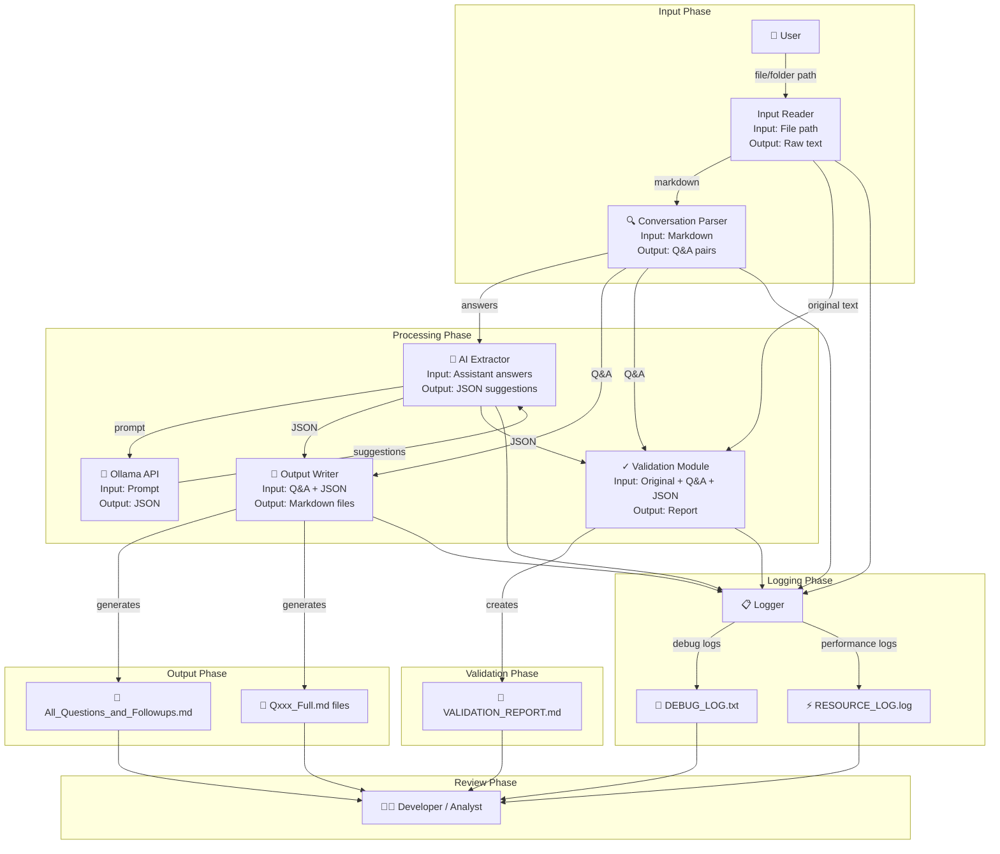

```mermaid
flowchart TD
    %% Input Layer
    subgraph Input [Input Phase]
        User["👤 User"] -->|file/folder path| Reader["📂 Input Reader"]
        Reader["Input Reader<br>Input: File path<br>Output: Raw text"] -->|markdown| Parser
    end

    %% Processing Layer
    subgraph Process [Processing Phase]
        Parser["🔍 Conversation Parser<br>Input: Markdown<br>Output: Q&A pairs"] -->|answers| AI
        Parser -->|Q&A| Writer
        Parser -->|Q&A| Validator
      
        AI["🤖 AI Extractor<br>Input: Assistant answers<br>Output: JSON suggestions"] -->|prompt| Ollama
        Ollama["🧠 Ollama API<br>Input: Prompt<br>Output: JSON"] -->|suggestions| AI
        AI -->|JSON| Writer
        AI -->|JSON| Validator
    end

    %% Output Layer
    subgraph Output [Output Phase]
        Writer["📝 Output Writer<br>Input: Q&A + JSON<br>Output: Markdown files"] -->|generates| QAll
        Writer -->|generates| QFull
      
        QAll["📄 All_Questions_and_Followups.md"]
        QFull["📄 Qxxx_Full.md files"]
    end

    %% Validation Layer
    subgraph ValidationPhase [Validation Phase]
        Validator["✓ Validation Module<br>Input: Original + Q&A + JSON<br>Output: Report"] -->|creates| VReport
        Reader -->|original text| Validator
        VReport["📄 VALIDATION_REPORT.md"]
    end

    %% Logging Layer
    subgraph Logging [Logging Phase]
        Logger["📋 Logger"] 
        Reader --> Logger
        Parser --> Logger
        AI --> Logger
        Writer --> Logger
        Validator --> Logger
      
        Logger -->|debug logs| Debug["🐛 DEBUG_LOG.txt"]
        Logger -->|performance logs| Perf["⚡ RESOURCE_LOG.log"]
    end

    %% Review Layer
    subgraph Review [Review Phase]
        QAll --> Developer["👨‍💻 Developer / Analyst"]
        QFull --> Developer
        VReport --> Developer
        Debug --> Developer
        Perf --> Developer
    end
```
