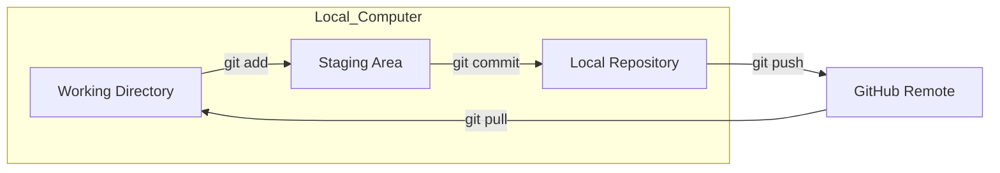
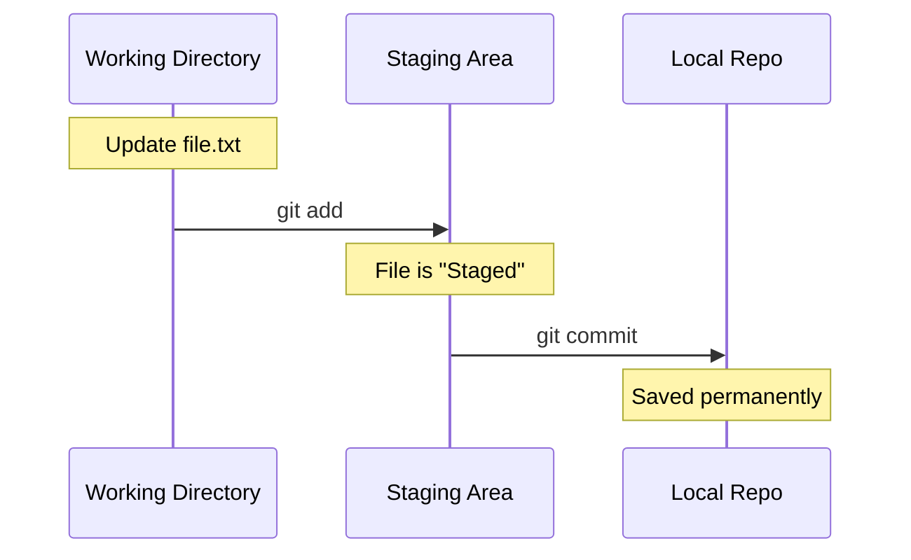
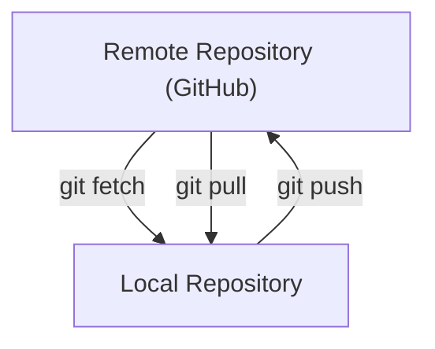
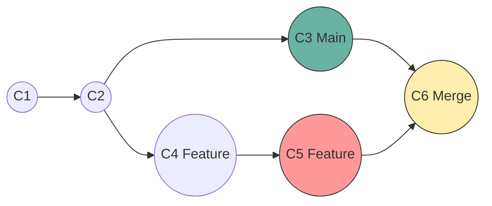

## 1. Introduction: Git vs. GitHub

* **Git**: A version control system that runs locally on your computer. It tracks every change in your files (what, when, by whom) and manages `versions` of your project history. It works offline.
* **GitHub**: A cloud-based platform (owned by Microsoft) that hosts Git repositories. It serves as a central hub for sharing code, collaboration, and backup (remote repository).

### Core Concepts

* **Local vs. Remote**:
  * **Local**: Your computer (Working Directory, Staging Area, Local Repository).
  * **Remote**: The cloud (GitHub server, Remote Repository).



---

## 2. Getting Started

### Installation

* **Windows**: Download from [git-scm.com](https://git-scm.com). Select 32-bit or 64-bit.
* **Mac**: Use Homebrew or download from the official site.
* **Linux**: Use the package manager for your distribution.

**Verify Installation**:

```bash
git --version
```

### Configuration (One-time Setup)

Git needs to know who you are to track commits.

```bash
git config --global user.email "your_email@example.com"
git config --global user.name "Your Name"
```

---

## 3. The Git Workflow

The lifecycle of a file in Git involves three main stages.



1. **Working Directory**: Where you create, modify, and delete files.
2. **Staging Area**: A preview zone where you prepare changes (add files) before saving them.
3. **Local Repository (.git)**: A secured database where snapshots (versions) of your files are permanently recorded.

---

## 4. Basic Git Commands

### Initialize a Repository

Start tracking a folder with Git.

```bash
git init
```

### Check Status

See which files are modified, staged, or untracked.

```bash
git status
```

### Stage Changes

Move files from Working Directory to Staging Area.

```bash
git add <filename>      # Stage specific file
git add .               # Stage current directory and everything inside
```

### Commit Changes

Save staged changes to the Local Repository.

```bash
git commit -m "Descriptive message about what changed"
```

### View History (Logs)

```bash
git log --oneline       # Condensed view (hash + message)
```

---

## 5. Working with Remotes (GitHub)

### Syncing Workflow Diagram



### Commands

* **Clone**: `git clone <url>`
* **Push**: `git push origin main`
* **Pull**: `git pull` (Downloads AND merges changes)
* **Fetch**: `git fetch` (Downloads changes but DOES NOT merge)

---

## 6. Branching & Merging

Branching allows you to work on new features or experiments in isolation.

### Visualizing Branches



### Merge Conflicts Scenario

**The Problem**: Two branches edit line 10 of `style.css` differently.
**Code Conflict State**:

```css
body {
<<<<<<< HEAD
    background-color: blue;
=======
    background-color: red;
>>>>>>> feature-branch
}
```

**The Fix**:

1. Open `style.css`.
2. Delete markers (`<<<<`, `====`, `>>>>`) and unwanted code.
3. Keep the desired code (e.g., `background-color: purple;`).
4. Run:
   ```bash
   git add style.css
   git commit -m "Resolved background color conflict"
   ```

---

## 7. Advanced: Real-World Scenarios

### Scenario 1: The "Oops" Moment (Undo)

You modified `config.js` but broke the app. You haven't committed yet.

* **Case A: Change is NOT staged** (Just viewing difference)

  ```bash
  git restore config.js
  # Result: File goes back to last committed state.
  ```
* **Case B: Change IS staged** (You ran `git add`)

  ```bash
  git restore --staged config.js  # Moves out of staging
  git restore config.js           # Reverts actual file
  ```

### Scenario 2: Switching Branches with Unfinished Work (Stash)

You are on `feature-login` but need to fix a bug on `main`. You can't commit yet.

1. **Save Work**: `git stash` (Working directory is now clean).
2. **Switch**: `git checkout main`.
3. **Fix Bug**: Edit -> Add -> Commit.
4. **Return**: `git checkout feature-login`.
5. **Restore Work**: `git stash pop` (Brings back your unfinished changes).

### Scenario 3: Cleaning Up History (Rebase vs Merge)

* **Merge**: Adds a "Merge request" commit. Good for history truth.
* **Rebase**: Replays your commits on top of main. Good for clean history.
  * *Command*: `git rebase main` (while on feature branch).

---

## 8. Pull Request (PR) Workflow

1. **Create Branch**: `git checkout -b feature-dark-mode`
2. **Work**: Edit files, `git add .`, `git commit -m "Add dark colors"`
3. **Push**: `git push origin feature-dark-mode`
4. **GitHub**:
   * Go to repo URL.
   * Click "Compare & pull request".
   * Review diffs.
   * Click "Create pull request".
5. **Merge**: Teammate reviews and clicks "Merge pull request".

---

## 9. Git Cheat Sheet

| Action           | Command                                        |
| :--------------- | :--------------------------------------------- |
| **Setup**  | `git init`, `git clone <url>`              |
| **Stage**  | `git add .`, `git add <file>`              |
| **Commit** | `git commit -m "msg"`                        |
| **Branch** | `git branch <name>`, `git checkout <name>` |
| **Update** | `git pull`, `git fetch`                    |
| **Upload** | `git push origin <branch>`                   |
| **Undo**   | `git restore <file>`, `git reset`          |
| **Temp**   | `git stash`, `git stash pop`               |
