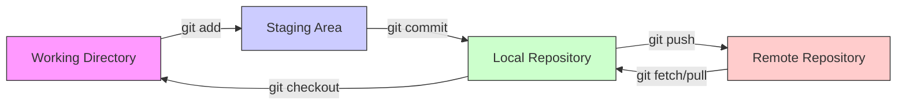
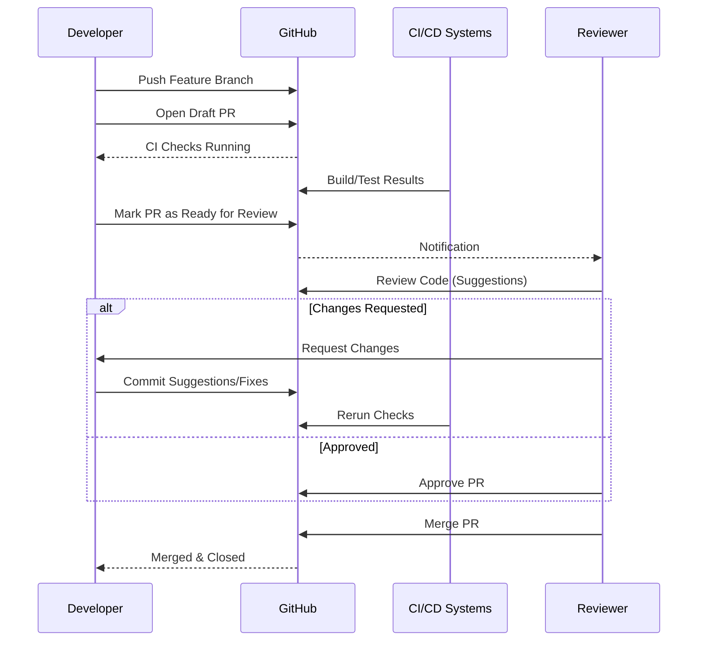
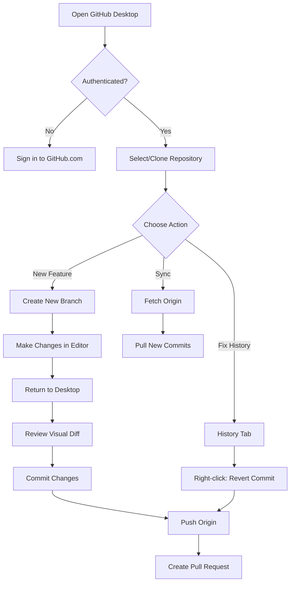

## 1. Git

### What is Git?

Git is a **distributed version control system** used to track changes in source code during software development. It allows multiple developers to work together on non-linear development histories efficiently.

### Key Concepts

- **Repository (Repo)**: A storage space where your project lives. It can be local (on your computer) or remote (on a server like GitHub).
- **Commit**: A snapshot of your repository at a specific point in time. It saves your changes.
- **Branch**: A parallel version of a repository. It allows you to work freely without affecting the main codebase.
- **Merge**: Taking the changes from one branch and integrating them into another.
- **Staging Area (Index)**: A middle ground where you prepare files before committing them.

### Git Lifecycle Diagram

The following diagram illustrates how files move between different states in Git:



### Essential Commands

| Command                   | Description                                                   |
| :------------------------ | :------------------------------------------------------------ |
| `git init`              | Initializes a new Git repository.                             |
| `git clone <url>`       | Copies a remote repository to your local machine.             |
| `git status`            | Displays the state of the working directory and staging area. |
| `git add <file>`        | Adds changes to the staging area.                             |
| `git commit -m "msg"`   | Saves changes to the local repository with a message.         |
| `git push`              | Uploads local repository content to a remote repository.      |
| `git pull`              | Fetches and integrates changes from the remote repository.    |
| `git branches`          | Lists, creates, or deletes branches.                          |
| `git checkout <branch>` | Switches to a different branch.                               |
| `git merge <branch>`    | Joins two or more development histories together.             |

### Advanced Git Concepts

#### Stashing

Used when you want to record the current state of the working directory and the index, but want to go back to a clean working directory.

- `git stash save "message"`: Stash changes with a message.
- `git stash pop`: Apply the stored changes and remove them from the stash list.
- `git stash list`: View all stashed changes.

#### Rebasing vs. Merging

- **Merge**: Creates a new "merge commit" in the history. It preserves the history of both branches exactly as it happened.
- **Rebase**: Moves the entire feature branch to begin on the tip of the main branch. It rewrites history to create a linear path.
- **Command**: `git rebase main` (while on feature branch).
- **Warning**: Never rebase public branches that others are working on.

#### Resetting

- **Soft Reset** (`git reset --soft HEAD~1`): Moves HEAD back, but keeps changes in Staging.
- **Mixed Reset** (`git reset --mixed HEAD~1`): Default. Moves HEAD back, keeps changes in Working Directory (unstaged).
- **Hard Reset** (`git reset --hard HEAD~1`): Moves HEAD back and **destroys** all changes. Use with caution.

#### Ignoring Files (.gitignore)

A `.gitignore` file specifies intentionally untracked files that Git should ignore (e.g., build artifacts, temporary files, secrets).

```text
# Example .gitignore
node_modules/
dist/
*.log
.env
```

---

## 2. GitHub

### What is GitHub?

GitHub is a cloud-based hosting service for Git repositories. It provides a web-based graphical interface and access control/collaboration features.

### Key Features

- **Pull Requests (PR)**: core tool for collaboration.
- **Issues**: Tracking bugs and enhancements.
- **Actions**: CI/CD automation.
- **Projects**: Kanban boards and roadmaps.
- **Wiki**: Documentation for repositories.

### Repository Management

- **Settings**: Control repository visibility (Public/Private), rename repository, transfer ownership.
- **Collaborators**: Invite users to contribute to the repository.
- **Branch Protection Rules**: Prevent direct pushing to `main`, require PR reviews before merging, require status checks (CI) to pass.

### Advanced Collaborative Workflow

1. **Fork/Clone**: Get your own copy.
2. **Branch Protection**: Ensure `main` is protected.
3. **Draft Pull Requests**: Open a PR that is not ready for review yet to get early feedback.
4. **Code Review**:
   - **Line comments**: Discuss specific lines of code.
   - **Suggestions**: Propose code changes directly in the comment that can be committed by the author with one click.
   - **Review Status**: Request changes, Comment, or Approve.
5. **Resolving Conflicts**: Fix merge conflicts directly in the GitHub web editor or locally.
6. **Releases**: Package software versions using Git Tags and provide release notes.

### Pull Request Flow Diagram



---

## 3. GitHub Desktop

### What is GitHub Desktop?

GitHub Desktop is a free, open-source application that allows you to interact with GitHub and other Git services using a GUI. It simplifies complex commands.

### Why use GitHub Desktop?

- **Visual History**: Intuitive graph of commits.
- **No Command Line needed**: Great for beginners or quick actions.
- **Visual Diffs**: Syntax-highlighted diffs for many languages.

### Advanced Workflows in Desktop

#### Handling Merge Conflicts

When a merge conflict occurs (e.g., after pulling from `main` into your feature branch):

1. GitHub Desktop flags the conflicted files.
2. It offers to open the file in your default editor (e.g., VS Code).
3. After fixing the conflict in the editor, return to Desktop.
4. It detects the fix and allows you to "Continue Merge".

#### History Management

- **Reverting**: Right-click any commit in the history tab and select **Revert changes in commit**. This creates a new commit that undoes the changes.
- **Amend Last Commit**: If you forgot to add a file or made a typo in the message, you can modify the most recent unpushed commit.

#### Comparison View

- Before merging, use the "Branch" dropdown to compare your current branch with `main`.
- See exactly which files are ahead or behind.

### GitHub Desktop Interaction Diagram


