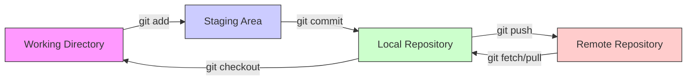

## 1. Git

### What is Git?

Git is a **distributed version control system** used to track changes in source code during software development. It allows multiple developers to work together on non-linear development histories efficiently.

### Key Concepts

- **Repository (Repo)**: A storage space where your project lives. It can be local (on your computer) or remote (on a server like GitHub).
- **Commit**: A snapshot of your repository at a specific point in time. It saves your changes.
- **Branch**: A parallel version of a repository. It allows you to work freely without affecting the main codebase.
- **Merge**: Taking the changes from one branch and integrating them into another.
- **Staging Area (Index)**: A middle ground where you prepare files before committing them.

### Git Lifecycle Diagram

The following diagram illustrates how files move between different states in Git:

### Essential Commands

| Command                   | Description                                                   |
| :------------------------ | :------------------------------------------------------------ |
| `git init`              | Initializes a new Git repository.                             |
| `git clone <url>`       | Copies a remote repository to your local machine.             |
| `git status`            | Displays the state of the working directory and staging area. |
| `git add <file>`        | Adds changes to the staging area.                             |
| `git commit -m "msg"`   | Saves changes to the local repository with a message.         |
| `git push`              | Uploads local repository content to a remote repository.      |
| `git pull`              | Fetches and integrates changes from the remote repository.    |
| `git branches`          | Lists, creates, or deletes branches.                          |
| `git checkout <branch>` | Switches to a different branch.                               |
|                           |                                                               |
